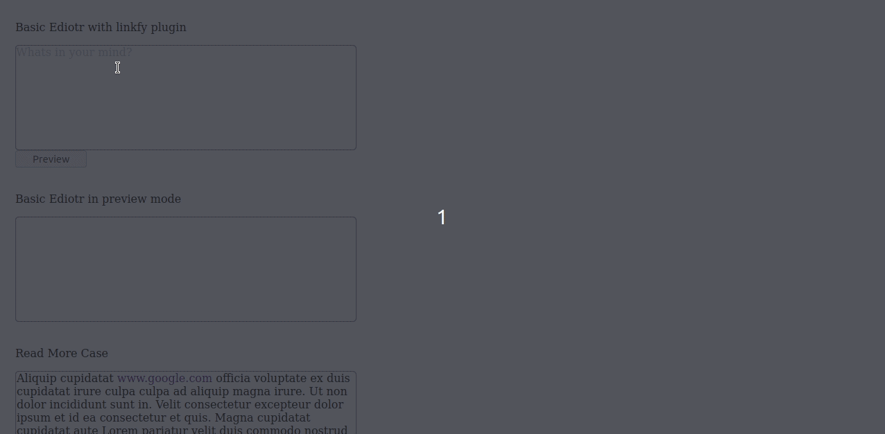

# React DraftJs Demo

This Demo use DraftJs to build a TextEditor with features like links and Readmore content.


## CodeSandBox
https://codesandbox.io/s/agitated-glade-ggvig

## How to Run
```
git clone https://github.com/sohaibqasem/react-draftjs-demo.git
npm install
npm start
```
### Getting Started with Create React App

This project was bootstrapped with [Create React App](https://github.com/facebook/create-react-app).
